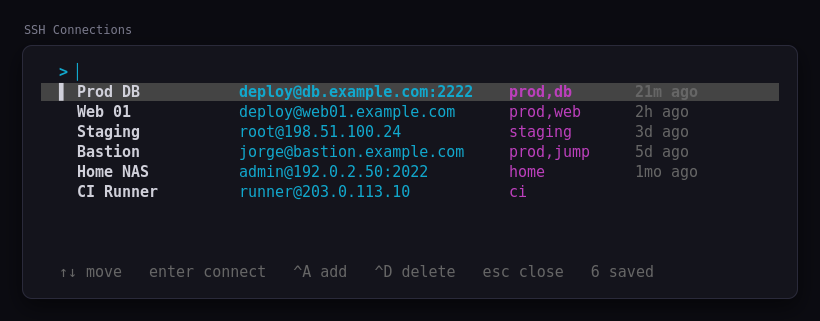
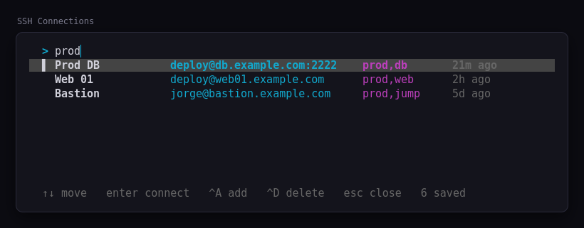

# herdr-ssh-manager

A saved-connection manager for SSH, as a [Herdr](https://herdr.dev) plugin.

Save the hosts you actually use, fuzzy-find them in a modal popup, and hit Enter.

The session does not stay in the popup. A popup is session-modal and dies with its process,
which is the wrong home for an SSH connection you want to keep — so Enter hands `ssh` to a
real pane instead:

- **the pane you opened the picker from**, when its shell is sitting idle, or
- **a new tab**, when that pane is busy running something.

Either way the tab takes the connection's name, so a row of tabs reads as the hosts you
are on. The name stays after you disconnect — Herdr's `tab rename` has no way to restore
the automatic title — so rename it back yourself if you want the number.

"Busy" is decided by asking Herdr whether the pane's shell still owns its foreground process
group, so an agent, an editor or a running build all count — the picker will not type over
work in progress.



## Install

```sh
herdr plugin install jorge07RD/herdr-ssh-manager
```

Requires Herdr **0.8.0** or newer. **No Rust toolchain needed** on the platforms below:
installing downloads the prebuilt binary for this release and verifies its SHA-256 before
putting it in place.

| Platform | Prebuilt |
| --- | --- |
| macOS, Apple Silicon | `aarch64-apple-darwin` |
| macOS, Intel | `x86_64-apple-darwin` |
| Linux x86_64 | `x86_64-unknown-linux-musl` (static) |
| Windows x86_64 | `x86_64-pc-windows-msvc` |
| anything else (Linux ARM, …) | builds from source |

Anywhere else — and on any download failure, checksum mismatch, or version with no published
release — the install step explains why and falls back to `cargo build --release`, which needs
[Rust](https://rustup.rs) 1.88+. So installing is never harder than compiling, and usually
much faster.

## Keybinding

Herdr plugin manifests cannot declare keybindings, so add one to **your own** Herdr config
(`~/.config/herdr/config.toml`) to get the picker on a key:

```toml
[[keys.command]]
key = "prefix+shift+s"
type = "plugin_action"
command = "herdr-ssh-manager.open-picker"
description = "SSH connections"
```

Pick whatever key you like, but note that Herdr's own defaults already take `prefix` plus
`s q o w g c p n e h j k l v x z r b tab minus 1..9` and `shift` plus `R N G W D T X P`
(`prefix+s` in particular opens Herdr's settings). `prefix+shift+s` is free and keeps the
mnemonic.

There is a second action, `herdr-ssh-manager.open-add`, that opens the add form directly.
Both also show up wherever Herdr lists plugin actions.

## Picker keys

| Key | Action |
| --- | --- |
| any printable character | filter (fuzzy, matches name, user, host, port and tags) |
| `Backspace` | delete a character from the filter |
| `↑` `↓` / `Ctrl-P` `Ctrl-N` | move the selection |
| `Enter` | connect — runs `ssh` in your current pane, or a new tab if it is busy |
| `Ctrl-A` | add a connection without leaving the picker |
| `Ctrl-E` | edit the selected connection |
| `Ctrl-D` | delete the selected connection (asks first) |
| `Esc` | clear the filter; on an empty filter, close |
| `q` / `Ctrl-C` | close without connecting |

Every printable key goes to the filter, fzf-style, which is why add, edit and delete sit on
control chords rather than on `a`, `e` and `d`.

### Editing

`Ctrl-E` — and `herdr-ssh-manager edit <id>` — shows the whole record and lets you change one
field at a time, rather than walking you through every field in sequence:

```
? Edit `Prod DB`
> Name             Prod DB
  Host             db.example.com
  User             deploy
  Port             2222
  Identity file    ~/.ssh/id_ed25519
  Jump host        bastion.example.com
  Tags             prod, db
  Extra ssh args   -o ServerAliveInterval=30
  Notes            primary replica
  Save changes
  Discard
[ssh -p 2222 -i ~/.ssh/id_ed25519 -J bastion.example.com -o ServerAliveInterval=30 deploy@db.example.com]
```

The help line shows the `ssh` command the entry currently resolves to, so the effect of a
change is visible before you save. Nothing is written until you pick **Save changes**, and the
cursor stays on the field you just edited. `Discard`, or `Esc`, leaves the entry untouched.

Editing keeps the connection's id and its last-connected time, so renaming an entry never
breaks `herdr-ssh-manager connect <id>` or loses its history. In the picker your filter is left
alone too — you narrowed the list to reach that entry.

`herdr-ssh-manager edit <id> --port 2200` still works for scripting; passing any field flag
skips the interactive view entirely.



The filter is fuzzy, so `pdb` finds `Prod DB` and `w01` finds `web01.example.com`.

## Command line

The plugin binary is a normal CLI, useful for scripting and for machines where you would
rather not use the popup:

```sh
herdr-ssh-manager add                     # interactive form
herdr-ssh-manager add --name "Prod DB" --host db.example.com --user deploy --port 2222 \
                      --identity-file ~/.ssh/id_ed25519 --jump-host bastion.example.com \
                      --tag prod --tag db --extra-ssh-arg=-C
herdr-ssh-manager list                    # table, most recently used first
herdr-ssh-manager list --json             # machine-readable
herdr-ssh-manager edit prod-db --port 2200
herdr-ssh-manager remove prod-db
herdr-ssh-manager connect prod-db         # skip the picker
herdr-ssh-manager connect prod-db --print # show the ssh command, run nothing
herdr-ssh-manager import                  # pull hosts out of ~/.ssh/config
herdr-ssh-manager pick                    # the picker, in whatever terminal you are in
herdr-ssh-manager where                   # path of connections.toml
```

Flags whose value starts with a hyphen need the `=` form: `--extra-ssh-arg=-C`.

## Importing `~/.ssh/config`

```sh
herdr-ssh-manager import --dry-run    # preview
herdr-ssh-manager import              # pick what to import
herdr-ssh-manager import --yes        # take everything
herdr-ssh-manager import --path /etc/ssh/ssh_config
```

`Host` blocks are read for `HostName`, `User`, `Port`, `IdentityFile` and `ProxyJump`, and
imported entries are tagged `ssh-config`. Pattern entries (`Host *`, `Host web-?`, `Host !prod`)
are skipped because they describe defaults rather than a destination, `Include` is not
followed, and hosts already saved — same host, user and port — are left out.

Importing copies values; it does not keep the two files in sync afterwards.

## Where your connections live

In `$HERDR_PLUGIN_CONFIG_DIR/connections.toml` — run `herdr plugin config-dir herdr-ssh-manager`
(or `herdr-ssh-manager where`) for the exact path. Outside Herdr it falls back to
`$XDG_CONFIG_HOME/herdr-ssh-manager/` (`%APPDATA%\herdr-ssh-manager\` on Windows).

Nothing is ever written inside the plugin checkout, which `herdr plugin install` overwrites
on update. The file is written atomically — temp file, then rename — so a popup killed
mid-save cannot leave it half-written, and it is created mode `0600` because it records
usernames, hostnames and private-key paths. If it is ever unparseable, it is moved aside
as `connections.toml.corrupt-<timestamp>` and a warning tells you where it went.

Hand-editing is fine:

```toml
[[connection]]
id = "prod-db"                     # stable handle used by edit/remove/connect
name = "Prod DB"                   # label in the picker
host = "db.example.com"
port = 2222                        # omitted when 22
user = "deploy"
identity_file = "~/.ssh/id_ed25519"   # -i
jump_host = "bastion.example.com"     # -J
tags = ["prod", "db"]
extra_ssh_args = ["-o", "ServerAliveInterval=30"]
notes = "primary replica"
last_connected_at = "2026-08-19T14:14:01Z"   # maintained for you
```

Which becomes:

```sh
ssh -p 2222 -i ~/.ssh/id_ed25519 -J bastion.example.com -o ServerAliveInterval=30 deploy@db.example.com
```

The destination always comes last, so a stray flag in `extra_ssh_args` cannot swallow it,
and hosts starting with `-` are rejected.

## Outside Herdr

Run anywhere else — a plain terminal, an SSH session, a `cargo run` — `pick` and `connect`
have no pane to hand the session to, so the process `exec`s into `ssh` and *becomes* the
connection. Same for `herdr-ssh-manager connect <id>`, which always connects in place.

If handing off to a pane fails for any reason, the picker says why and connects in place
rather than leaving you with nothing.

## Windows

Everything works, but **bind different action ids**. Herdr rejects duplicate action and pane
ids even when they are platform-gated, so the Windows entries are suffixed:

```toml
[[keys.command]]
key = "prefix+shift+s"
type = "plugin_action"
command = "herdr-ssh-manager.open-picker-windows"   # note the suffix
description = "SSH connections"
```

Your config lives at `%APPDATA%\herdr\config.toml`.

Why the split: Herdr hands a pane or action's *relative* program straight to `CreateProcessW`,
which resolves it against Herdr's own directory rather than the plugin root, and never appends
`.exe`. So `./target/release/herdr-ssh-manager` cannot spawn on Windows at all — before 0.7.0
the keybinding simply did nothing. The Windows entries instead run `powershell`, which is on
`PATH` and therefore does resolve, and it hands off to `scripts/launch.ps1` by absolute path.
Invoking the wrong id for your platform is not silent: Herdr answers `platform_unsupported`.

One real difference remains. Windows has no `execvp`, so `Enter` runs `ssh` as a child process
and exits with its status instead of being replaced by it. The practical effect is one extra
process in the tree.

## Local development

```sh
git clone https://github.com/jorge07RD/herdr-ssh-manager
cd herdr-ssh-manager
cargo build --release          # `herdr plugin link` does NOT run [[build]] for you
herdr plugin link .
herdr plugin list
herdr plugin action list
herdr plugin action invoke herdr-ssh-manager.open-picker
herdr plugin config-dir herdr-ssh-manager
cargo test
```

`herdr plugin unlink .` when you are done.

## License

MIT — see [LICENSE](LICENSE).
